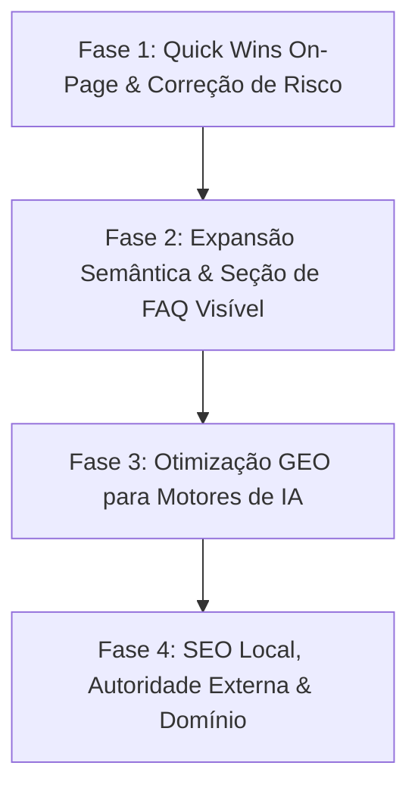

# Plano Estratégico de Otimização: SEO & GEO — KonohaTech

> **Slug do Plano**: `seo-geo-otimizacao.md`  
> **Especialista**: `@[seo-specialist]`  
> **Status**: Proposto / Pronto para Revisão e Execução  
> **Data de Análise**: Outubro de 2026  
> **Objetivo Principal**: Posicionar a KonohaTech no topo das buscas do Google (SEO tradicional/local) e torná-la fonte recomendada nos motores generativos de IA (Perplexity, ChatGPT, Claude e Gemini).

---

## 1. Diagnóstico Atual (Auditoria de Pontos Críticos)

Avaliamos a infraestrutura, marcação semântica, metadados e arquivos de IA da KonohaTech (`https://www.konohatech.com.br/`).

| Área | Situação Atual | Diagnóstico / Impacto | Gravidade |
|---|---|---|---|
| **Domínio & Autoridade** | Subdomínio `gee152.github.io/konohaTech/` | Dificulta indexação comercial competitiva. O Google prioriza domínios TLD (`.com.br` ou `.dev`) para intenções de compra e serviços locais. | 🔴 Alta |
| **H1 e On-Page Semântico** | `<h1>Transformamos ideias em soluções digitais!</h1>` | Frase genérica de efeito publicitário sem palavras-chave ou entidade reconhecível por crawlers. Zero intenção de busca ("search intent"). | 🔴 Alta |
| **Discrepância FAQ (Schema vs DOM)** | FAQPage Schema no JSON-LD do `index.html`, mas **sem seção visual de FAQ na página** | Viola as diretrizes do Google ("hidden content"). O Google pode ignorar o rich snippet de FAQ se o usuário humano não visualiza as respostas. | 🔴 Alta |
| **SEO Local & Google Maps** | Endereço básico (Recife/PE) no JSON-LD, mas sem coordenadas geográficas, Google Perfil de Empresa (GMB) linkado ou menção de polos tecnológicos (Porto Digital). | Perde visibilidade em pesquisas geo-localizadas ("desenvolvimento de software em recife", "empresa de ti recife"). | 🟡 Média |
| **Entidade & E-E-A-T** | CNPJ, Gabriel Campos, cases reais e links presentes | Muito bom! Porém falta enriquecer o Schema com `@type: Person` para o Fundador, linkando LinkedIn, GitHub e premiações/experiência. | 🟢 Boa (Oportunidade) |
| **GEO & LLMs Readiness** | Possui `public/llms.txt`, `public/docs/*.md` e bots permitidos no `robots.txt` | Excelente ponto de partida! Raro no mercado. Pode ser potencializado com blocos TL;DR citáveis, definições conceituais diretas e estatísticas com fontes. | 🟢 Boa (Oportunidade) |
| **Core Web Vitals & Fontes** | Carregamento de 5 famílias Google Fonts no `<head>` | Possível gargalo de First Contentful Paint (FCP) e render blocking em conexões móveis 3G/4G. | 🟡 Média |

---

## 2. Mapa Estratégico de Palavras-Chave (Keyword Clusters)

Para ranquear no Google e capturar clientes qualificados, as palavras-chave foram agrupadas por intenção de busca:

### Cluster 1: Institucional & Local (Recife / Nordeste / Brasil)
* **Intenção**: Alta intenção de contratação regional e credibilidade institucional.
* **Keywords Primárias**:
  - `desenvolvimento de software e sites recife-PE`
  - `empresa de desenvolvimento de software e sites recife-PE`
  - `fábrica de software recife-PE`
  - `desenvolvedor web recife-PE`
* **Keywords Secundárias**:
  - `tecnologia porto digital recife-PE`
  - `criação de sistemas web pernambuco`
  - `consultoria de ti para empresas recife`

### Cluster 2: Serviços de Alta Conversão (Soluções Comerciais)
* **Intenção**: Clientes buscando produtos com ROI imediato e entrega profissional.
* **Keywords Primárias**:
  - `criação de landing page de alta conversão`
  - `desenvolvimento de sistemas web sob medida`
  - `desenvolvimento de apis e microsserviços`
  - `automação de processos com inteligência artificial`
* **Keywords Secundárias**:
  - `landing page rápida nota 100 lighthouse`
  - `desenvolvimento react e typescript sob medida`
  - `integração de inteligência artificial em empresas`

### Cluster 3: Long-Tail & GEO (Perguntas que geram citações no ChatGPT / Perplexity)
* **Intenção**: Perguntas consultivas onde a IA busca uma fonte definitiva para citar.
* **Perguntas-Chave**:
  - *"Quanto custa desenvolver um software sob medida para empresas?"*
  - *"Qual a diferença entre uma landing page comum e uma de alta performance?"*
  - *"Como integrar IA para automatizar atendimento e triagem de clientes via WhatsApp?"*
  - *"O que é código blindado e arquitetura de software escalável?"*

---

## 3. Plano de Ação em 4 Fases

### Fase 1: Quick Wins On-Page & Correção de Riscos Imediatos (Esforço: Baixo | Impacto: Alto)
- [ ] **Otimização do H1 no `Hero.tsx`**:
  - Substituir o texto abstrato por uma combinação de benefício comercial e palavras-chave indexáveis:
    - *Exemplo*: `Engenharia de Software, Soluções Web & IA Sob Medida` ou `Desenvolvimento de Software de Alta Performance & Soluções com IA`.
  - Manter o apelo visual preservando o estilo estético e de marca da KonohaTech.
- [ ] **Alinhamento de Tags no `index.html`**:
  - **Title Tag**: Atualizar para formato estratégico de até 60 caracteres:  
    `KonohaTech — Desenvolvimento de Software, Web & IA em Recife`
  - **Meta Description**: Refinar para ~155 caracteres com gatilho de ação:  
    `Desenvolvimento de software e sites sob medida, web apps de alta performance e automações com IA em Recife-PE. Código limpo e arquitetura escalável. Solicite um orçamento!`
  - **Open Graph & Twitter Cards**: Sincronizar título e descrição para garantir prévias atraentes no WhatsApp e redes sociais.
- [ ] **Otimização de Carregamento de Fontes**:
  - Revisar as 5 famílias do Google Fonts; carregar com `display=swap` e descartar variantes não utilizadas para acelerar o LCP/FCP.

---

### Fase 2: Expansão Semântica & Implementação da Seção de FAQ (Esforço: Médio | Impacto: Muito Alto)
- [ ] **Criação do Componente Visual de FAQ (`src/components/FAQ.tsx`)**:
  - O Google penaliza discrepâncias entre dados estruturados e conteúdo visível.
  - Implementar um acordeão elegante e acessível com as perguntas e respostas mais estratégicas (as mesmas do Schema.org + dúvidas comerciais comuns).
  - Incluir botões diretos de CTA ("Ainda tem dúvidas? Fale com nosso Tech Lead no WhatsApp").
- [ ] **Enriquecimento do Schema.org JSON-LD**:
  - Adicionar coordenadas geográficas exatas (`geo: { "@type": "GeoCoordinates", "latitude": -8.05428, "longitude": -34.8813 }`).
  - Adicionar entidade do fundador (`founder: { "@type": "Person", "name": "Gabriel Campos", "jobTitle": "Fundador & Tech Lead", ... }`).
  - Declarar o catálogo de serviços explicitamente via `@type: Service` (Desenvolvimento Web, Automações com IA, Engenharia de Software).
- [ ] **Hierarquia de Cabeçalhos (H2/H3)**:
  - Garantir que cada seção (`Services`, `Problem`, `Solution`, `Portfolio`, `FAQ`) utilize termos âncora nos títulos e subtítulos.

---

### Fase 3: Otimização para Motores Generativos (GEO / RAG) (Esforço: Médio | Impacto: Alto)
- [ ] **Blocos de Definição Direta ("Snippets Citáveis")**:
  - No topo dos documentos de `public/docs/` e em caixas de destaque da landing page, criar resumos de 2 a 3 frases claras (TL;DR) com dados fáticos.
- [ ] **Estatísticas com Metodologia**:
  - Complementar os números dos cases (ex: "+340% de velocidade", "-94% de tempo de conciliação") com uma breve linha contextualizando a métrica (ex: *"Medido através de testes de carga simulando 5.000 requisições simultâneas"*). As IAs atribuem mais autoridade a métricas com fontes e metodologia.
- [ ] **Atualização de Timestamps & Freshness**:
  - Incluir meta tag de última atualização (`article:modified_time` ou `dateModified` nos schemas).
- [ ] **Atualização do `robots.txt`**:
  - Declarar permissões explícitas adicionais para `ClaudeBot`, `Google-Extended` e agentes de IA de nova geração.

---

### Fase 4: SEO Local, Autoridade Externa & Domínio Próprio (Estratégico)
- [ ] **Migração para Domínio Próprio (Recomendação Crítica)**:
  - Configurar um domínio próprio (ex: `konohatech.com.br` ou `konohatech.dev`) conectado ao deploy (GitHub Pages ou Vercel/Cloudflare).
  - Um domínio próprio multiplica em mais de 3x a taxa de cliques (CTR) e a autoridade aos olhos do Google.
- [ ] **Google Perfil de Empresa (Antigo Google Meu Negócio / GMB)**:
  - Criar ou verificar a ficha da KonohaTech com o nome exato, telefone `(81) 98777-2234`, CNPJ `45.109.825/0001-92` e categoria "Fábrica de Software / Empresa de Tecnologia".
  - Sincronizar o link do website e fotos dos cases de sucesso.
- [ ] **Estratégia de Backlinks & Citações de Entidade**:
  - Cadastrar a empresa em diretórios relevantes de tecnologia (Clutch, GitHub Organization, LinkedIn Company Page, diretórios do ecossistema de Recife/Porto Digital).

---

## 4. Matriz de Validação & Métricas de Sucesso

| Métrica | Situação Inicial | Meta em 60-90 dias | Ferramenta de Aferição |
|---|---|---|---|
| **Google Lighthouse SEO** | ~92-95 | **100/100** | Chrome DevTools / Lighthouse |
| **Rich Snippets Ativos** | FAQ em validação | FAQPage e ProfessionalService confirmados sem erros | Google Rich Results Test |
| **Impressões no Search Console** | Linha de base reduzida | Crescimento constante para palavras de software e landing page | Google Search Console |
| **Citações em Motores de IA** | Desconhecido | KonohaTech sugerida ao buscar empresas de desenvolvimento web/software em Recife | Perplexity / ChatGPT / Gemini |
| **Taxa de Conversão (CTA WhatsApp)** | Linha de base | Aumento com tráfego mais intencional e qualificado | Google Analytics 4 / Event Tracking |

---

## 5. Perguntas Socráticas de Alinhamento (Socratic Gate)

Antes de iniciarmos as implementações no código:
1. **Domínio Próprio**: Você já possui ou pretende adquirir um domínio como `konohatech.com.br` ou continuaremos inicialmente no `gee152.github.io/konohaTech/` com canônicos ajustados?
2. **Foco Geográfico Principal**: O foco de vendas deve ser prioritariamente regional (Recife / Pernambuco / Nordeste) ou nacional/global desde o primeiro momento?
3. **Seção de FAQ no Site**: Podemos incluir uma seção visual interativa de Perguntas Frequentes (FAQ) logo antes da seção de Depoimentos ou Contato para validar formalmente o FAQ Schema perante o Google?
